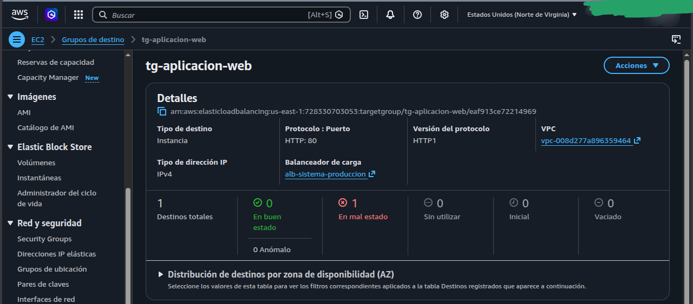
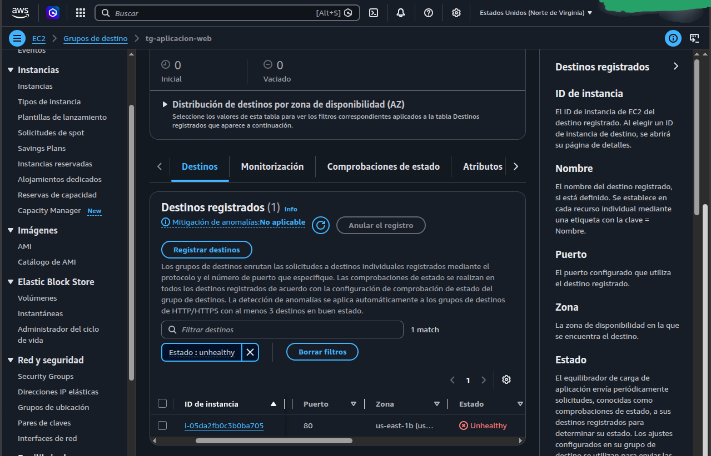

# AWS Chaos Engineering: Análisis Forense de Denegación de Servicio (DoS) y Límites de Resiliencia en Arquitecturas Elásticas

Este proyecto documenta un caso de estudio de Ingeniería del Caos, donde se diseñó una infraestructura multicapa (N-Tier) automatizada con **Terraform** para evaluar los límites lógicos y de telemetría de una arquitectura elástica reactiva en **AWS** ante un ataque masivo de inundación de tráfico.

## Diseño Arquitectónico y Seguridad Básica
La infraestructura base se desplegó de forma inmutable bajo las siguientes directrices de diseño corporativo:
*   **Aislamiento Perimetral (VPC):** Red segmentada en 2 subredes públicas (frente del balanceador) y 2 subredes privadas (capa de cómputo) distribuidas en múltiples Zonas de Disponibilidad (Multi-AZ).
*   **Filtro Temerario:** Un **Application Load Balancer (ALB)** público como único punto de entrada autorizado, enrutando tráfico hacia el grupo de instancias.
*   **Seguridad de Datos:** Plantillas de lanzamiento (`Launch Templates`) configuradas con la propiedad `encrypted = true` en discos EBS (`gp3`) para mitigar riesgos de extracción física de datos en el centro de datos.
*   **Política Elástica Reactiva:** Un Auto Scaling Group (ASG) controlado por una política nativa de Seguimiento de Objetivos (`TargetTrackingScaling`) calibrada de forma sensible al 15% de uso de CPU promedio.

---

## 🛠️ Ciclo de Vida del Proyecto y Comandos Ejecutados

El laboratorio se gestionó en su totalidad desde la terminal de **Linux Mint** utilizando la siguiente secuencia estricta de comandos:

### 1. Inicialización y Despliegue de Infraestructura
```bash
# Descargar conectores oficiales de AWS e inicializar el entorno
terraform init

# Validar que la sintaxis de las variables y security groups fuera correcta
terraform validate

# Simular el plano arquitectónico y verificar el conteo de recursos
terraform plan

# Crear la infraestructura elástica viva en la cuenta de AWS
terraform apply
```

### 2. Inyección del Caos (Test de Estrés con Docker)
Para eliminar problemas de dependencias locales, se delegó la ejecución del test a contenedores aislados de **Docker Hub**, corriendo un script de **K6 de Grafana** configurado a **350 usuarios concurrentes sin `sleep`**, golpeando una página de cálculo matemático pesado en PHP/Apache:
```bash
docker run --rm -i -v "\$(pwd)":/apps -w /apps grafana/k6 run test-estres.js > logs/reporte-k6.txt
```

### 3. Cierre Seguro y Optimización Financiera
Al concluir las mediciones, se desmanteló el entorno de forma inmediata para asegurar la Capa Gratuita:
```bash
terraform destroy
```

---

## 📊 Resultados Empíricos del Ataque (Análisis de K6)

Al procesar la bitácora generada en `logs/reporte-k6.txt`, los datos duros revelaron un colapso instantáneo del servidor basal debido a la violencia del bombardeo HTTP:

| Métrica Crítica           | Valor Registrado     | Significado Técnico                                        |
| :------------------------ | :------------------- | :--------------------------------------------------------- |
| **`vus` (Virtual Users)** | `350 concurrentes`   | Carga máxima simulada golpeando simultáneamente.           |
| **`http_reqs` (Total)**   | `324,829`            | Volumen total de impactos HTTP enviados al ALB.            |
| **`http_reqs` (Tasa)**    | **`2,164.57 req/s`** | Velocidad de inundación masiva por segundo.                |
| **`http_req_failed`**     | **`100.00%`**        | **Colapso total.** Todas las peticiones fueron rechazadas. |
| **`checks_succeeded`**    | `0.00%`              | Cero respuestas exitosas (Estado 200 OK).                  |

---

## 🚨 Diagnóstico Forense: ¿Por qué falló el Auto Scaling?

A pesar de que el código de Terraform estaba correctamente estructurado, la infraestructura **no logró aprovisionar el segundo servidor de apoyo**, quedando en evidencia las siguientes lecciones de arquitectura cloud:

### 1. Sin tiempo de reacción al servicio de Auto Scaling
Dado que la tasa de inundación de **2,164 req/s** saturó el procesador al 100% en el segundo uno, la máquina murió de inmediato, mucho antes de que el reloj de CloudWatch procesara los datos para activar la alarma, en resumen el ataque fue fulminante rápidamente, que no dio tiempo de reaccionar al sistema.

### 2. El Bloqueo Lógico por Estado "Unhealthy"
Al colapsar el software, el Application Load Balancer realizó su comprobación de rutina (`Health Check`) y detectó que la instancia no respondía. Como se detalla en la evidencia oficial de la consola de AWS, el balanceador la marcó inmediatamente en letras rojas como **`Unhealthy - Health checks failed`**. 

Por diseño de seguridad nativo, **AWS congela las políticas de Auto Scaling si el servidor base está enfermo**, asumiendo que duplicar una máquina rota es un desperdicio financiero. El sistema entró en un bucle de bloqueo y no ejecutó el Scale-Out.

---

## 📸 Evidencias Oficiales Extraídas de AWS

- ### Métrica de Disponibilidad del Target Group (0 en buen estado)



Esta captura del panel demuestra la evidencia del colapso total de la capa de cómputo. El contador registra **Destinos totales: 1** y **En mal estado: 1** en letras rojas, confirmando que la ráfaga de 2,164 req/s dejó la infraestructura con un 0% de servidores en buen estado de forma totalmente instantánea.

### Registro de Fallo en Comprobación de Salud (Health Check Failed)



Esta captura demuestra la tabla de destinos registrados donde se audita el estado de la instancia `i-05da2fb0c3b0ba705` colocada en la zona `us-east-1b`. El sistema operativo y el software Apache/PHP colapsaron bajo la carga masiva, provocando que el balanceador arrojara el estado explícito de **`Unhealthy - Health checks failed`**, deteniendo el enrutamiento de tráfico

---

## 💡 Conclusiones y Recomendaciones de Ingeniería (Mitigación)
Para migrar esta arquitectura elástica reactiva a un entorno de producción real que soporte inundaciones HTTP masivas de forma segura, un Consultor DevOps recomienda implementar dos capas extras de blindaje:
1.  **AWS WAF (Web Application Firewall):** Acoplar un firewall frente al ALB con reglas de **Rate Limiting** para bloquear de forma perimetral en milisegundos a cualquier IP que supere las 100 req/s, impidiendo que el ataque toque los servidores.
2.  **Capacidad Basal Sobredimensionada:** Configurar `asg_desired_capacity = 3` en zonas Multi-AZ para diluir el impacto inicial de ráfagas espontáneas mientras las alarmas de métricas logran procesar los datos.

Para este caso, como vemos fue un ataque controlado de Denegación de Servicio (DoS), que proviene de una sola dirección ip (nuestro contenedor Docker), si llegará a subir servidores a producción, para mitigar ataques avanzados como los DDoS que son más difíciles de detectar porque llegan desde miles de IP que clonan el comportamiento humano legítimo, se recomienda que antes de llegar a ese punto, utilize los servicios **Cloudfront + AWS Shield (Standard/ Advanced)** para proteger su instancia y sitio web.


